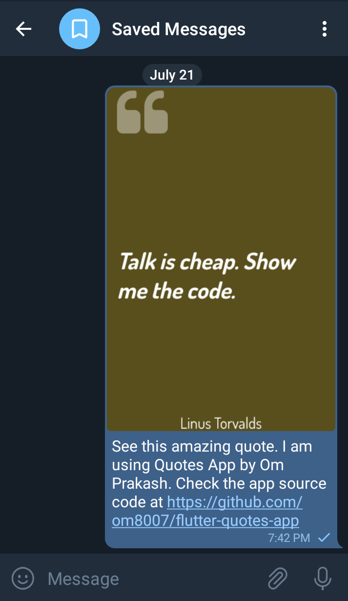
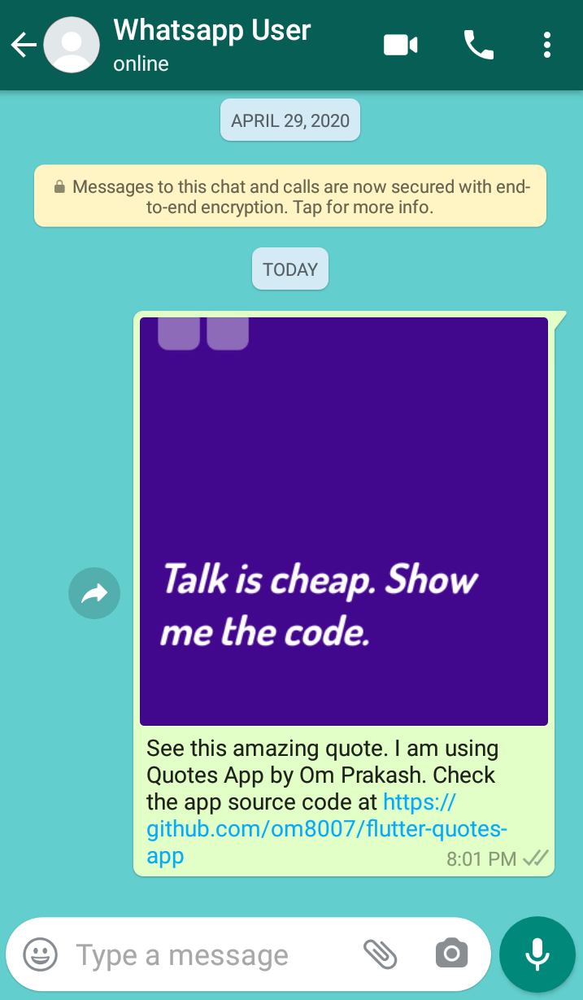

# quotes_app

A new Flutter Quotes App project.

## Outline
- Uses Firebase (Firestore as backend to fetch quotes from)
- Uses pageview to show swipeable quotes
- Uses Repaint Boundary to get image data

### Packages Used
- _google_fonts: ^1.1.0_
- _random_color: ^1.0.5_
- _cloud_firestore: ^0.13.5_
- _simple_permissions: ^0.1.6_
- _path_provider: ^1.6.11_
- _intl: ^0.16.1_
- _wc_flutter_share: ^0.2.2_

## Screenshots

#### After adding Save and Share options

### New to flutter ? Start here...

A few resources to get you started if this is your first Flutter project:

- [Lab: Write your first Flutter app](https://flutter.dev/docs/get-started/codelab)
- [Cookbook: Useful Flutter samples](https://flutter.dev/docs/cookbook)

For help getting started with Flutter, view our
[online documentation](https://flutter.dev/docs), which offers tutorials,
samples, guidance on mobile development, and a full API reference.
